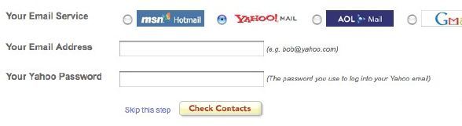
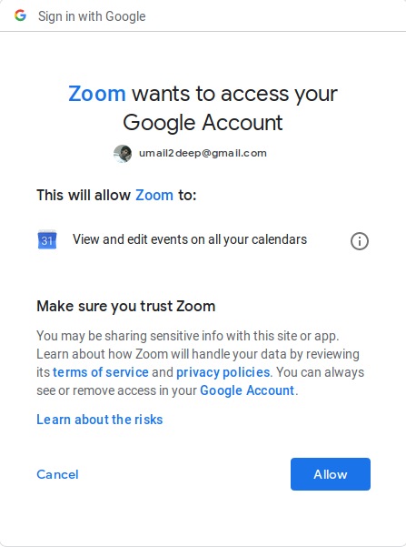

# Oauth & OpenId Draft

## Authentication & Authorization

### Authentication

The process of proving the identity to the system/software/service by the user.
Via username/password or fingerprints .. etc

Corresponding http status

> 401 UNAUTHORIZED
The request has not been applied because it lacks valid authentication credentials for the target resource.

Though the status code says unauthorized , it is actually related to authenticatoin.

### Authorization

The user is authenticated, and now what resources/information can the user access using the system/service.
Authorizaiton is the process of allowing or restricting access to resources/information based on roles & ownership.

Corresponding http status

> 403 FORBIDDEN
The server understood the request but refuses to authorize it.

## Oauth 1.0

Before Oauth 1.0 , we have to share our credentials to third party applications to share contacts from email account,

Example,

Oh is this phising ?
No this is how it worked back in 2007.

It was released in 2007, goal was to enable one service to access the another service without authenticating.
For example , here zoom application wants to add meeting invite to my google calender.
Oauth is all about giving access to zoom to add the meeting invite to my google calender 
without sharing my google credentials to zoom.

