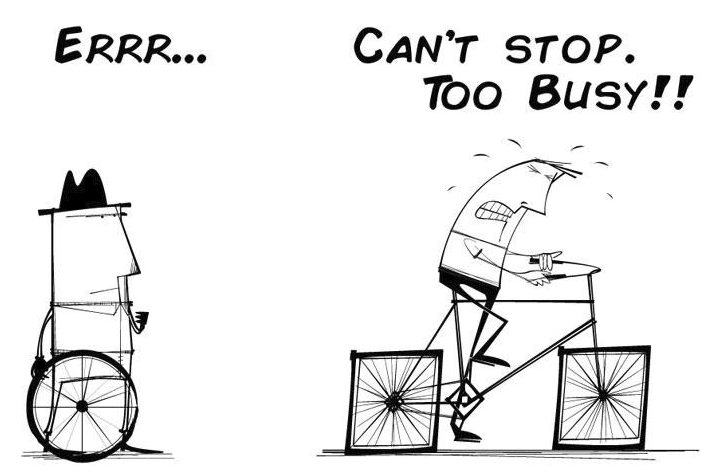
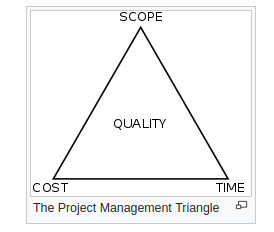

# Agile Challenges & Learnings

## 1st challenge - Software quality

- The most important one is to deliver the high quality/production ready deliverables at the end of the each sprint
- Most of the times this is missed and it leads to increase in technical debt.
- This also slows down the productivity
- At a later point this leads to the maintainence nightmare.

## 2nd challenge - Commitment

- There is a constant challenge when choosing between these priorities
  - Features
  - Schedule
  - Quality

This reminds me the areas that influence the Project's Success - From Construx - Code Complete course

- First is all about the requirement gathering
- Second reason project planning
- Third reason - code quality

Commiting between features/schedule/quality to deliver a bug free working software is always a constant challenge.

## 3rd challenge - Estimation

Many times, we work on something that is completly new from our past experiences, estimating those and adding to the task board doens't help much.

## 4th challenge - Pressure

The biggest challenge for millienials is that , the task board stifles innovation, experimentaion and out of the box
thinking. Task board now has refocussed thoughts on how to get rid of the task in the shortest time possible, the card
on the board is a constant reminder to get it to done bucket

Like how Simon Sinek's says in one of the talk - how we are addicted to the triggers of dopamine
with the number of likes and comments , which gives the feeling of reward.

## 5th challenge - Motivation

### Retrospection & Review

> The Magic Wand

#### Retrospection

One of the finest motivation factor which I observed is the retrospection meeting.
It lifts the morale of the team.

1. Appreciate each and every good work done by the team.
    - Everybody contributes & participates without having fear/worrying about missing how to showcase his/her work
    - Enables team to work selfless
2. Discuss about things that could have been done better.
    - It serves as a constant reminder for everyone on the team to identify oppurtunities to do better.
    - Helps to highlight the mistakes of the team.
    - Teammates voluntarily identify their mistakes.
    - Increases transparency

> It had a very huge imapact.

#### Review Meeting

Client's feedback and requirement changes always add a mixed responses. But mostly the client's attention,appreciation & feedback had always kept the team high.

> When these reviews and feedback loop missed in the lifecycle , it shakes the productivity & morale of the team.

> Recently read a book "Nine Lies About Work: A Freethinking Leader’s Guide to the Real World" In chapter#5 Lie #5: People need feedback,
the author points out that its not the feedback, it is the positive attention that improves the productivity of the team.

This is something I had seen it in my eyes. The attention the stakeholders give to their product and team does the magic.
The review meeting had enabled it.

But sometimes it turns out as a mundane stuff.

-------

> Opinions expressed are solely my own and do not express the views or opinions of my employer.
> It's a collective work.